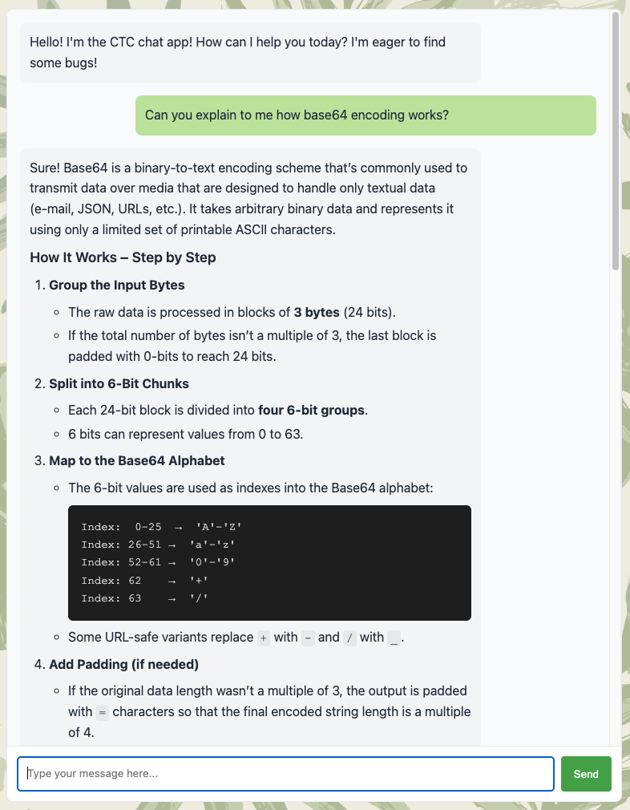
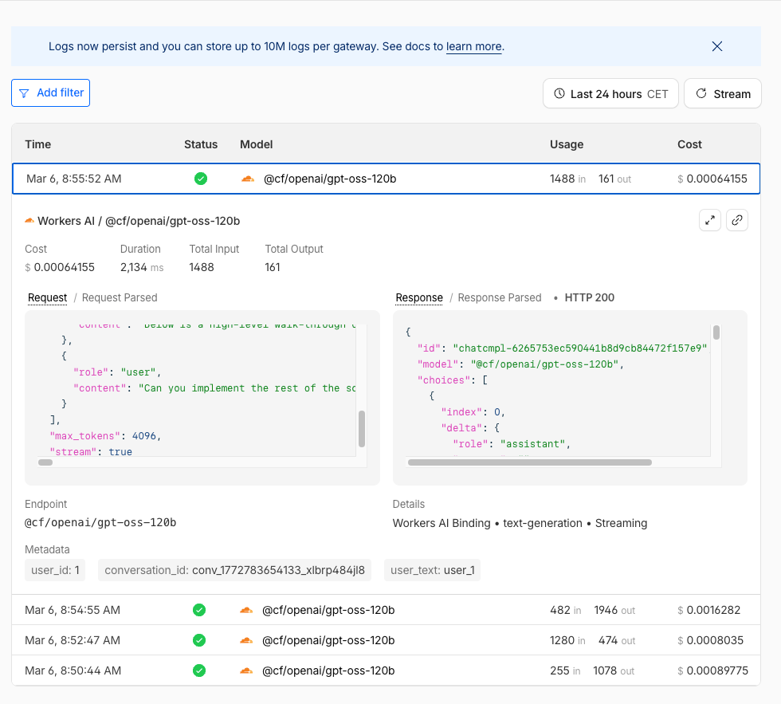
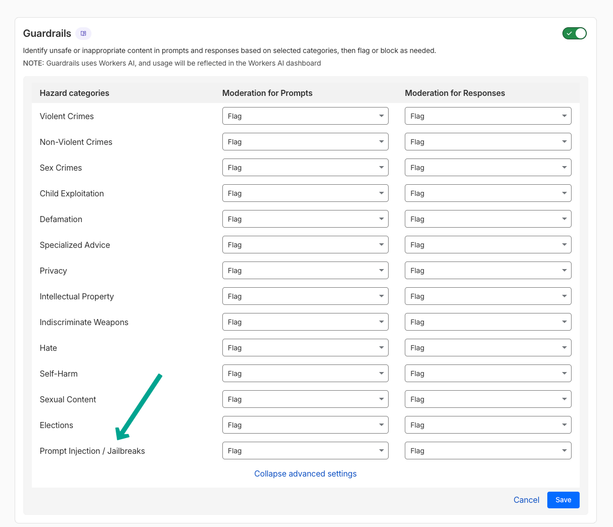
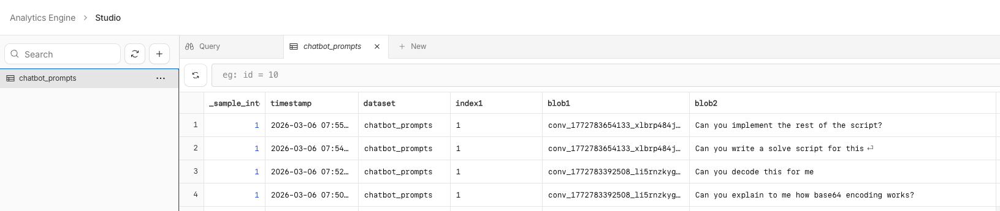

# CTFd LLM Chatbot

This project adds an authenticated LLM assistant to CTFd. The goal is to give participants a helpful chatbot that can explain concepts and provide hints during a CTF, without simply solving challenges or returning flags.

It consists of two parts:

- CTFd plugin: issues a signed JWT for the current user so the chatbot can verify who is making a request.
- Cloudflare Worker: serves the chat UI, validates the JWT, applies rate limits and request-size limits, sends prompts to the model, and can log usage through Analytics Engine and AI Gateway.

## Summary

This chatbot uses a Cloudflare-hosted AI model and is configured to act as a CTF helper rather than a solver. It enforces server-side limits on context size, a maximum of 50 messages per conversation, and 5 requests per minute per user, while also logging usage per user. The system prompt is tuned to steer participants toward hints and explanations instead of directly giving away solutions or flags. For a 6-hour event with roughly 160 participants, the rough cost estimate is around EUR 100.

### Observed behavior

- Usage was solid, and the general feedback was that the bot performed better than expected and better than publicly available options used the year before.
- The main behavioral goal held up well: it politely refused to hand out flags or fully solve challenges, and it pushed back when users asked for too much.
- It could be somewhat overcautious on dual-use requests, such as helping write a brute-force script, which is arguably a reasonable tradeoff for a CTF assistant.
- Known UX limitations are that chat history disappears when the page is closed or reloaded.



## CloudFlare Worker

### Model configuration

Model selection is configured with `vars.AI_MODEL` in `worker/wrangler.jsonc`.
The chatbot system prompt is configured with `vars.SYSTEM_PROMPT` in `worker/wrangler.jsonc`.

For a list of supported models hosted by CloudFlare, see https://developers.cloudflare.com/workers-ai/models/. Via AI gateway it is also possible to route to third-party model providers.

### AI Gateway

AI Gateway is optional but recommended. Set `vars.AI_GATEWAY_ID` in `wrangler.jsonc` to your gateway ID, or leave it empty to disable gateway usage.
Setting a gateway allows to perform in-depth logging of all interactions with filtering, including a cost breakdown.



It is also possible to configure/flag guardrail categories. However, the out-of-the-box prompt injection/jailbreak guardrail in our experience is a bit *too* effective.
Guardrails work via LLama Guard3 8B. If this is desirable, it would be better to implement an additional step in the worker to also send the prompt off to this model and log the result (jailbreak or not) in Analytics Engine for later analysis.



### Prompt logging

Prompt logging can be performed via AI Gateway, but it holds the full context for each turn. Beyond that, Analytics Engine is also enabled by default and will log prompts. You can later filter through the data using SQL syntax. Note: information passing through Analytics Engine is sampled, meaning that it may omit data!



### Deployment

The worker is based off the template at https://github.com/cloudflare/llm-chat-app-template/blob/main/wrangler.jsonc.
Install dependencies:

```bash
npm install
```

Create the KV namespaces used for rate limiting:

```bash
npx wrangler kv namespace create RATE_LIMIT_KV
npx wrangler kv namespace create RATE_LIMIT_KV --preview
```

Copy the returned `id` and `preview_id` values into `wrangler.jsonc`:

```jsonc
"kv_namespaces": [
  {
    "binding": "RATE_LIMIT_KV",
    "id": "YOUR_RATE_LIMIT_KV_NAMESPACE_ID",
    "preview_id": "YOUR_RATE_LIMIT_KV_PREVIEW_ID"
  }
]
```

Set the JWT secret used to validate the CTFd auth token:

```bash
npx wrangler secret put CHATBOT_JWT_SECRET
```

Analytics Engine is enabled by default in `wrangler.jsonc`:

```jsonc
"analytics_engine_datasets": [
  {
    "binding": "ANALYTICS",
    "dataset": "chatbot_prompts"
  }
]
```

If you rename bindings such as `RATE_LIMIT_KV` or `ANALYTICS`, update the matching names in `src/types.ts`, `src/rateLimit.ts`, and `src/index.ts`.

Deploy the worker:

```bash
npx wrangler deploy
```

## CTFd plugin

Install the plugin in CTFd's `plugins` folder. 
Generate and configure `CHATBOT_JWT_SECRET` as an environment variable.

In CTFd, create a page (with authentication required):

```
<iframe src="/chatproxy/" style="width:100%; height: calc(100vh - 4em);"></iframe>
<style style="text/css">
  footer { display: none !important; }
  main { margin-bottom: 0 }
</style>
```

If you already run your CTFd instance behind CloudFlare, you can configure a worker route to point `/chatproxy` to the worker. 

If you don't run behind CloudFlare, it's easiest to set up a reverse proxy for this path that points to the worker. Otherwise, some more configuration will be necessary for the JWT cookie that is set by CTFd to be seen by the worker.
